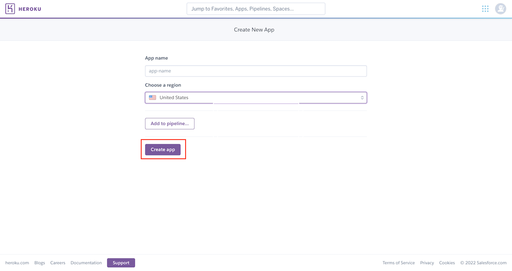
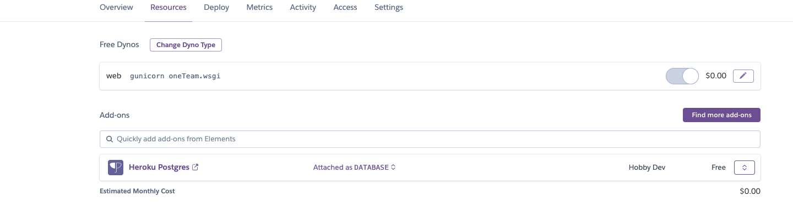
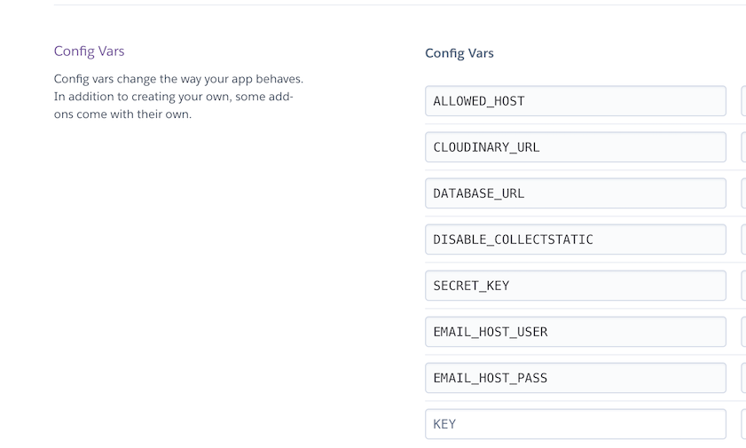
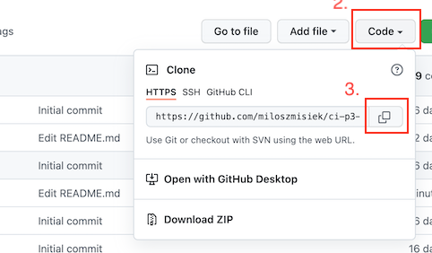

# <div align='center'> Cutback: Django REST Framework API <!-- omit in toc --> </div>

## **Contents**

- [**Overview**](#overview)
- [**Technologies Used**](#technologies-used)
- [**Testing**](#testing)
  - [Manual Testing](#manual-testing)
  - [PEP8 Validation](#pep8-validation)
  - [Bugs](#bugs)
    - [Known Bugs](#known-bugs)
    - [Solved Bugs](#solved-bugs)
- [**Information Architecture**](#information-architecture)
    - [Database](#database)
    - [Entity-Relationship Diagram](#entity-relationship-diagram)
    - [Data Modeling](#data-modeling)
- [**Deployment**](#deployment)
  - [Using Heroku to deploy the project](#using-heroku-to-deploy-the-project)
  - [Fork a repository](#fork-a-repository)
  - [Clone a repository](#clone-a-repository)
- [**Credits**](#credits)
  - [Acknowledgments](#acknowledgments)

# **Overview**

This repository serves as Cutback Backend REST API. Its purpose is to provide data to be used in Front-End design with [React. js](https://reactjs.org/). For the main project's documentation refer to [Cutback](https://github.com/miloszmisiek/ci-p5-cutback) project.
The API endpoint can be found [here](https://drf-api-cutback.herokuapp.com/)

# **Technologies Used**

- ### Languages

  - [Python 3.9.12](https://www.python.org/downloads/release/python-3912/): the primary language used to develop the server-side of the website.

- ### Frameworks

  - [Django](https://www.djangoproject.com/): python framework used to create all the logic.
  - [Django REST Framework](https://www.django-rest-framework.org/): Django toolkit for building Web APIs.

- ### Databases

  - [SQLite](https://www.sqlite.org/): was used as a development database.
  - [PostgreSQL](https://www.postgresql.org/): the database used to store all the data.

- ### Other tools

  - [Git](https://git-scm.com/): the version control system used to manage the code.
  - [Pipenv](https://pypi.org/project/pipenv/): the package manager used to install the dependencies. Pipenv combines using `pip` and `virtualenv` - they work togehter as `pipenv`.
  - [Gunicorn](https://gunicorn.org/): the webserver used to run the website.
  - [Psycopg2](https://www.python.org/dev/peps/pep-0249/): the database driver used to connect to the database.
  - [Django-allauth](https://django-allauth.readthedocs.io/en/latest/): the authentication library used to create the user accounts.
  - [Django-cloudinary-storage](https://pypi.org/project/django-cloudinary-storage/): Django package that facilitates integration with Cloudinary by implementing Django Storage API.
  - [Pillow](https://pillow.readthedocs.io/en/stable/): This library provides extensive file format support, an efficient internal representation, and fairly powerful image processing capabilities.
  - [Django-phonenumber-field](https://pypi.org/project/django-phonenumber-field/): A Django library that interfaces with python-phone numbers to validate, pretty print and convert phone numbers.
  - [Django-money](https://github.com/django-money/django-money): A little Django app that uses py-moneyed to add support for Money fields in your models and forms.
  - [Django-countries](https://pypi.org/project/django-countries/): A Django application that provides country choices for use with forms, flag icons static files, and a country field for models.
  - [dj-rest-auth](https://dj-rest-auth.readthedocs.io/en/latest/): a set of REST API endpoints to handle User Registration and Authentication tasks.
  - [Simple JWT](https://django-rest-framework-simplejwt.readthedocs.io/en/latest/): provides a JSON Web Token authentication backend for the Django REST Framework.
  - [dj-database-url](https://pypi.org/project/dj-database-url/): Django utility that allows utilizing the 12factor inspired DATABASE_URL environment variable to configure Django application.
  - [django-cors-headers](https://pypi.org/project/django-cors-headers/): adds Cross-Origin Resource Sharing (CORS) headers to responses. This allows in-browser requests to Django applications from other origins.
  - [Heroku](https://dashboard.heroku.com/): the hosting service used to host the website.
  - [GitHub](https://github.com/): used to host the website's source code.
  - [VSCode](https://code.visualstudio.com/): the IDE used to develop the website.
  - [Chrome DevTools](https://developer.chrome.com/docs/devtools/open/): was used to debug the website.
  - [Draw. io](https://www.lucidchart.com/) was used to make a flowchart for the README file.
  - [PEP8](https://pep8.org/): was used to validate Python code for the website.
  - [Grammarly](https://www.grammarly.com/): was used to check grammar and typo errors.

[Back to contents](#contents)

# **Testing**

## Manual Testing

Manual testing implemented for the Back-End application listed below:

|     | User Actions           | Expected Results | Y/N | Comments    |
|-------------|------------------------|------------------|------|-------------|
| **APPS**                                                                          |
| **Profiles**     |                        |                  |      |             |
| 1           | Logged-in user enters profiles URL | Profile List renders all profiles as an array of objects. User cannot create a profile, only list view available | Y |    Profile creation is handled by django-signals      |
| 2           | Profile owner enters profile's detailed URL with existing PK | Renders profile's details in the browser, `is_owner` property is set to `true`, user can update details with form and submit with `PUT` method. The **DELETE** button is visible. | Y |   Form fields are populated with fetched profile data.       |
| 3           | User clicks **DELETE** button | Profile is deleted. The user is redirected to the Profile List view. The deleted profile is not displayed. The user instance is destroyed with django-signals. | Y |       |
| 4           | The user enters the profile's detailed URL which he does not own with existing PK | Renders profile's details in the browser, `is_owner` property is set to `false`, update form is not displayed. The **DELETE** button is not visible. | Y |          |
| 5           | Profile owner change data and submits with `PUT` button | The updated profile detail view is rendered. Data is saved in the database. | Y |          |
| 6           | Filters: User selects a product in the field filters | List all profiles which owners give a rating to the selected product  | Y |   DRF known bug for `[invalid name]` present    |
| 7           | Filters: User selects ordering by products_count ascending  | List of all profiles is displayed sorted by products_count in ascending order | Y |          |
| 8           | Filters: User selects ordering by products_count descending  | List of all profiles is displayed sorted by products_count in descending order | Y |          |
| 9           | Filters: User selects ordering by ratings_count ascending  | List of all profiles is displayed sorted by ratings_count in ascending order | Y |          |
| 10           | Filters: User selects ordering by ratings_count descending  | List of all profiles is displayed sorted by ratings_count in descending order | Y |          |
| 11           | Filters: User selects ordering by comments_count ascending  | List of all profiles is displayed sorted by comments_count in ascending order | Y |          |
| 12           | Filters: User selects ordering by comments_count descending  | List of all profiles is displayed sorted by comments_count in descending order | Y |          |
| **Products**     |                        |                  |      |             |
| 1           | Logged-in user enters product URL | Product List renders all products as an array of objects. Users can create a product in the form rendered in the browser. | Y |          |
| 2           | Logged-in user fills all required fields in the Product form and clicks the`POST` button | The submitted product is displayed in the browser and the database is updated. | Y |          |
| 3           | Logged-in user does not fill all required fields in the Product form and clicks the`POST` button | The required field is highlighted, and the user is prompted that the field cannot be blank | Y |          |
| 4           | Logged-in user does not fill all required fields in the Product form and clicks the`POST` button | The required field is highlighted, and the user is prompted that the field cannot be blank | Y |          |
| 5           | Product owner enters product's detailed URL with existing PK | Renders product's details in the browser, `is_owner` property is set to `true`, user can update details with form and submit with `PUT` method. The **DELETE** button is visible. | Y |   Form fields are populated with fetched product data.       |
| 6           | User enters product's detailed URL which he does not own with existing PK | Renders product's details in the browser, `is_owner` property is set to `false`, update form is not displayed. The **DELETE** button is not visible. | Y |          |
| 7           | Product owner change data and submits with `PUT` button | The updated product detail view is rendered. Data is saved in the database. | Y |          |
| 8           | Filters: User selects owner in the field filters | List all products of the selected owner  | Y |      |
| 9           | Filters: User selects InStock boolean value in the field filters  | List all products with selected value | Y |          |
| 10           | Filters: User selects Category value in the field filters  | List all products with selected category | Y |          |
| 11           | Filters: User types existing Brand name in the field filters  | List all products with specified Brand | Y |          |
| 12           | Filters: User selects ordering by price ascending  | List of all products is displayed sorted by price in ascending order | Y |          |
| 13           | Filters: User selects ordering by price descending  | List of all products is displayed sorted by price in descending order | Y |          |
| 14           | Filters: User selects ordering by avg_score ascending  | List of all products is displayed sorted by avg_score in ascending order | Y |          |
| 15           | Filters: User selects ordering by avg_score descending  | List of all products is displayed sorted by avg_score in descending order | Y |          |
| 16           | Filters: User selects ordering by all_scores ascending  | List of all products is displayed sorted by all_scores in ascending order | Y |          |
| 17           | Filters: User selects ordering by all_scores descending  | List of all products is displayed sorted by all_scores in descending order | Y |          |
| 18           | Filters: User selects ordering by title ascending  | List of all products is displayed sorted by title in ascending order | Y |          |
| 19           | Filters: User selects ordering by title descending  | List of all products is displayed sorted by title in descending order | Y |          |
| 20           | Filters: User selects ordering by created_at ascending  | List of all products is displayed sorted by title in created_at order | Y |          |
| 21           | Filters: User selects ordering by created_at descending  | List of all products is displayed sorted by created_at in descending order | Y |          |
| 22           | Filters: User types existing user's username in the search bar  | List of all products is displayed that matches username search query | Y |          |
| 23           | Filters: User types existing product's title in the search bar  | List of all products is displayed that matches product's title search query | Y |          |
| 24           | Filters: User types keyword to be searched in the product's description in the search bar  | List of all products is displayed that matches keyword in products descriptions search query | Y |          |
| **Comments**     |                        |                  |      |             |
| 1           | Logged-in user enters comments URL | Comments List renders all comments as an array of objects. Users can create a comment in the form rendered in the browser. | Y |          |
| 2           | Logged-in user fills all required fields in the Comment form and clicks the`POST` button | The submitted comment is displayed in the browser and the database is updated. | Y |          |
| 3           | Logged-in user does not fill all required fields in the Comment form and clicks the`POST` button | The required field is highlighted, and the user is prompted that the field cannot be blank | Y |          |
| 4           | Comment owner enters comment's detailed URL with existing PK | Renders comment's details in the browser, `is_owner` property is set to `true`, user can update details with form and submit with `PUT` method. The **DELETE** button is visible. | Y |   Form fields are populated with fetched comment data.       |
| 5           | User enters comment's detailed URL which he does not own with existing PK | Renders profile's details in the browser, `is_owner` property is set to `false`, update form is not displayed. The **DELETE** button is not visible. | Y |          |
| 6           | Comment owner change data and submits with `PUT` button | The updated comment detail view is rendered. Data is saved in the database. | Y |          |
| 7           | Filters: User selects Comment in the field filters | List all comments of the selected Comment  | Y |      |
| 8           | Filters: User selects Owner in the field filters  | List all comments with selected Owner | Y |          |
| **Ratings**     |                        |                  |      |             |
| 1           | Logged-in user enters rating URL | Rating List renders all ratings as an array of objects. Users can create ratings in the form rendered in the browser. | Y |          |
| 2           | Logged-in user fills all required fields in the Rating form and clicks the`POST` button | The submitted rating is displayed in the browser and the database is updated. | Y |   All fields are choice fields with default value - no blank       |
| 4           | Rating owner enters rating's detailed URL with existing PK | Renders rating's details in the browser, `is_owner` property is set to `true`, user can update details with form and submit with `PUT` method. The **DELETE** button is visible. | Y |   Form fields are populated with fetched rating data.       |
| 5           | User enters rating's detailed URL which he does not own with existing PK | Renders profile's details in the browser, `is_owner` property is set to `false`, update form is not displayed. The **DELETE** button is not visible. | Y |          |
| 6           | Rating owner change data and submits with `PUT` button | The updated rating detail view is rendered. Data is saved in the database. | Y |          |
| 7           | Filters: User selects Rating in the field filters | List all ratings of the selected Rating  | Y |      |
| 8           | Filters: User selects Owner in the field filters  | List all ratings with selected Owner | Y |          |
| **Registration**     |                        |                  |      |             |
| 1           | User clicks login button in the web browser DRF view | Login page renders with username and password fields to be filled | Y |          |
| 2           | User enters dj-rest-auth registration URL | The dj-rest-auth registration page renders with registration form  | Y |          |
| 3           | User fills all required fields for registration and clicks the`POST` button | The form is submitted and email verification is sent to the user's email address  | Y |   Email verification is handled by the all-auth library, `GET` method is not allowed       |
| 4           | User did not fill all required fields for registration and clicks the`POST` button | The form is rejected and the user is prompted which fields are required for registration.  | Y |      |
| 5           | User did not confirm his email address and loggs-in | User has Read-Only functionality - only `GET` function is allowed  | Y |     |
| 6           | User confirmed his email address and logs in | User has full functionality including `POST`, `PUT` and `DELETE`  | Y |     |
| 7           | User confirmed his email address and logs in | User has full functionality  | Y |     |

## PEP8 Validation

All code was formatted using [autopep8](https://pypi.org/project/autopep8/).
Additionally, manual validation was done with [PEP8 online](http://pep8online.com).

The only code which was left with long-line prompts is `settings.py` for code functionality.


## Bugs

All bugs were resolved in the development process. Any worth-mentioning bugs are documented in the project's GitHub issues panel.

### Known Bugs

1. MoneyField object returned in the field after validation error: [open](https://stackoverflow.com/questions/73505226/django-rest-framework-form-field-populated-with-object-representation-after-val).

### Solved Bugs

1. Custom "update" method in ProfileSerializer: [open](https://github.com/miloszmisiek/drf_api_cutback/issues/3).
2. Choice name display in Product Serializer get endpoint: [open](https://github.com/miloszmisiek/drf_api_cutback/issues/5).

[Back to contents](#contents)

# **Information Architecture**

### Database

- The deployed version of the application uses PostgreSQL as a database.
- SQLite was used for the development version.

### Entity-Relationship Diagram

- The ERD was created using [draw.io](draw.io).
- The ERD can be found [here](documentation/deployment/cutback-erd-final.jpg).

- The final production version defers with the planned data model. The location model was integrated to the Product model and currency choices were removed - only one was used for the app development.

### Data Modeling

1. **User**
  
  Created as a subclass of Django AbstractUser. Every user must confirm his account by email confirmation link.

   Name          | Database Key  | Field Type    | Validation |
| ------------- | ------------- | ------------- | ---------- |
| Email         | email         | EmailField    | max_length=50, unique=True, blank=False   |
| First Name    | first_name    | CharField     | max_length=50, blank=False    |
| Last Name     | last_name     | CharField     | max_length=50, blank=False    |
| Email Verified          | email_verified         | BooleanField  | default=False    |

2. **Profile**

  Designed as a custom model inheriting from Django models.Model. This model is a helper model for the User. Creates profile for User instance with OneToOne relationship.

- When the user did not select any profile picture, the default picture is added by django-signals.
- django-phonenumber-field is used to store phone number data.
  
   Name          | Database Key  | Field Type    | Validation |
| ------------- | ------------- | ------------- | ---------- |
| Owner      | owner      | OneToOne     |  settings.AUTH_USER_MODEL, on_delete=models.CASCADE    |
| Created At         | created_at         | DateTimeField    | auto_now_add=True    |
| Updated At    | updated_at    | DateTimeField     | auto_now=True    |
| Image     | image     | ImageField     | upload_to='images/', default='../default_profile_glasses_r9uhlr'    |
| Phone Number          | phone_number         | PhoneNumberField  |    |

1. **Products**

  Designed as a custom model inheriting from Django models.Model. This model is a core data structure for the application and is used to organize Products created by users.

- django-signals handles extra validation - users are allowed to store 10 products.
- django-money is used to store price data.

|     Name          | Database Key  | Field Type    | Validation |
| ------------- | ------------- | ------------- | ---------- |
| Owner      | owner      | OneToOne     |  settings.AUTH_USER_MODEL, on_delete=models.CASCADE    |
| Category         | category         | IntegerField    | choices=CATEGORIES, blank=False    |
| Price    | price    | MoneyField     | max_digits=10, decimal_places=2, blank=False, currency_choices=CURRENCY_CHOICES   |
| Title     | title     | CharField     | max_length=50, blank=False    |
| Description | description          | TextField         | max_length=500  |
| Brand | brand          | CharField         | max_length=50  |
| In Stock | in_stock          | BooleanField         | blank=False, default=False  |
| Created At         | created_at         | DateTimeField    | auto_now_add=True    |
| Updated At    | updated_at    | DateTimeField     | auto_now=True    |
| Address      | address      | CharField     | max_length=100|
| City         | city         | CharField    | max_length=50   |
| Country         | country         | CountryField    | blank_label='(select country)'   |
| Product      | product      | ForeignKey     |          Product, default=None, on_delete=models.CASCADE, related_name="product_location"    |

```Python
    CATEGORIES = (
        (0, "Boards"),
        (1, "Kites"),
        (2, "Wetsuits"),
        (3, "Harnesses"),
        (4, "Others"),
```

4. **Product Image**

  Designed as a custom model inheriting from Django models.Model. This model is a helper model to store Product galleries.

- django-signals handles extra validation - every product is allowed to store 5 pictures.
- When a Product instance is created and the user did not upload any pictures - the default picture is added by django-signals.

|     Name          | Database Key  | Field Type    | Validation |
| ------------- | ------------- | ------------- | ---------- |
| Product      | product      | ForeignKey     |          Product, default=None, on_delete=models.CASCADE, related_name="product_images"    |
| Image         | image         | ImageField    | upload_to='images/', default='../default-image_aqtoyb'   |

5. **Rating**

  Designed as a custom model inheriting from Django models.Model. This model stores Ratings for products. The product can be rated on a scale of 1-5.

|     Name          | Database Key  | Field Type    | Validation |
| ------------- | ------------- | ------------- | ---------- |
| Owner      | owner      | ForeignKey     |  settings.AUTH_USER_MODEL, on_delete=models.CASCADE    |
| Product      | product      | ForeignKey     |          Product, default=None, on_delete=models.CASCADE, related_name="product_rating"    |
| Score         | score         | PositiveSmallIntegerField    | default=0, choices=RATE_CHOICES   |
| Product      | product      | ForeignKey     |          Product, default=None, on_delete=models.CASCADE, related_name="product_location"    |
| Created At         | created_at         | DateTimeField    | auto_now_add=True    |

```Python
    RATE_CHOICES = (
        (5, "excellent"),
        (4, "very good"),
        (3, "good"),
        (2, "poor"),
        (1, "bad"),
    )
```

6. **Comment**
  Designed as a custom model inheriting from Django models.Model. This model stores Comments for products.

|     Name          | Database Key  | Field Type    | Validation |
| ------------- | ------------- | ------------- | ---------- |
| Owner      | owner      | ForeignKey     |  settings.AUTH_USER_MODEL, on_delete=models.CASCADE    |
| Product      | product      | ForeignKey     |          Product, default=None, on_delete=models.CASCADE, related_name="product_comments"    |
| Created At         | created_at         | DateTimeField    | auto_now_add=True    |
| Updated At    | updated_at    | DateTimeField     | auto_now=True    |
| Content        | content         | TextField    |     |

[Back to contents](#contents)

# **Deployment**

- **Setup of the local workspace:**
  - This project was developed with the use of [pipenv](https://pypi.org/project/pipenv/) to handle all dependencies
  - Managing a `requirements.txt` file can be problematic, so Pipenv uses the upcoming `Pipfile` and `Pipfile.lock` instead, which is superior for basic use cases.
  - Create a `Procfile` in the local workspace and type in `release: python manage.py makemigrations && python manage.py migrate` to allow for migration every time a new version is deployed and `web: gunicorn <name app>.wsgi:application` inside the file.
  - Commit and push to GitHub

- **Cloudinary**
This project uses [Cloudinary](https://cloudinary.com/) to host all static files. To allow the use of the hosting platform, the following steps were followed:
  - in `settings.py` following code is necessary for Cloudinary:

    ```Python
    CLOUDINARY_STORAGE = {
        'CLOUDINARY_URL': os.environ.get('CLOUDINARY_URL')
    }
    MEDIA_URL = '/media/'
    DEFAULT_FILE_STORAGE = 'cloudinary_storage.storage.MediaCloudinaryStorage'
    ```

    In `env.py` the Cloudinary API key is stored for security reasons.

---

## Using Heroku to deploy the project

This project was deployed using [Heroku](https://dashboard.heroku.com/) with the following steps:

1. Click on *New* in the top-right corner and then *Create New App*.


2. On the next page give the app a unique name.
3. Choose a region (the USA or Europe).
4. Click *Create app*.



5. Go to the *Resources* tab and search for PostgreSQL. Select *Hobby dev - Free* and click on the provision button to add it to the project



6. On the next page click on the *Settings* tab.
7. In the Settings page open *Config Vars* and add the following:



8. In `settings.py` we use `database` depending on `'DEV'` status in the environmental variables:

   ```Python
   DATABASES = {
        'default': {
            'ENGINE': 'django.db.backends.sqlite3',
            'NAME': BASE_DIR / 'db.sqlite3',
        } if 'DEV' in os.environ else dj_database_url.parse(
            os.environ.get('DATABASE_URL')
        )
    } 
    ```

    For the development version, `db.sqlite3` is used and for the production version, the Heroku Postgres database is.

9. This application uses [Gmail](https://www.google.com/intl/pl/gmail/about/) as an email SMTP server. This requires adding the following variables to the project's `settings.py` file:
      - `EMAIL_USE_TLS = True`
      - `EMAIL_PORT = 587`
      - `EMAIL_HOST = 'smtp.gmail.com'`
      - `EMAIL_HOST_USER = 'your_account@gmail.com'`
      - `EMAIL_HOST_PASSWORD = 'yourGmailPassword'`
  
    - For **Heroku** deployment add the following values to *Config Vars*:
      - `EMAIL_HOST_USER = 'your_account@gmail.com'`
      - `EMAIL_HOST_PASSWORD = 'yourGmailPassword'`
  
  For the development version, the email backend is set to print emails in the console. For the production version, the Gmail server is set up to handle email communication.

10. `DEBUG` in `settings.py` is `False` depending on the environmental variable `DEV` status. For production it is not included in Heroku Config Vars, resulting in a `False` statement. For development, it is `True` to use debugging functionality.
11. Commit and push your changes to GitHub.
12. Click on the *Deploy* tab.
13. In the *Deploy* page in the *Deployment Method* select GitHub.
14. After a successful connection to GitHub locate your repository and add it to Heroku.

  

15. In the *Manual Deploy* section confirm that the *main* branch is selected and click *Deploy Branch*
16. For Final Deployment confirm `DEBUG = False` in `settings.py` and delete `DISABLE_COLLECTSTATIC` from *Config Vars* in **Heroku**.
17. Commit and push changes to GitHub.


[Back to contents](#contents)

## Fork a repository

A fork is a copy of a repository. Forking a repository allows you to freely experiment with changes without affecting the original project. The steps are as follows:

1. On GitHub.com navigate to the repository page.
2. In the top-right corner of the page, click **Fork**.


You can fork a repository to create a copy of the repository and make changes without affecting the upstream repository.

## Clone a repository

In GitHub, you have the option to create a local copy (clone) of your repository on your device's hard drive. The steps are as follows:

1. On GitHub.com navigate to the repository page.
2. Locate the *Code* tab and click on it.
3. In the expanded window, click the two squares icon to copy the HTTPS link of the repository.



4. On your computer, open **Terminal**.
5. Navigate to the directory of your choice.
6. Type **git clone** and paste the copied link of the repository.
7. Press **Enter** and the local clone of the repository will be created in the selected directory.

[Back to contents](#contents)

# **Credits**

1. Project setup is based on [Code Institute](https://codeinstitute.net) tutorial video Django REST Framework.
2. The Comment app is copied from [Code Institute](https://codeinstitute.net) tutorial video Django REST Framework and adjusted for the Cutback needs.
3. Email confirmation functionality inspired from [Stack Overflow](https://stackoverflow.com/questions/24809505/django-allauth-how-to-properly-use-email-confirmed-signal-to-set-user-to-active).
4. Deployment section is based on the owner's previous project [OneTeam](https://github.com/miloszmisiek/ci-pp4-one_team).

## Acknowledgments

1. My family for being my biggest supporters throughout the entire time!
2. My mentor [Samantha Dartnall](https://www.linkedin.com/in/samantha-dartnall/) for guidance and support on the project.
3. [Stack Overflow](https://stackoverflow.com/) community for the best bug-solving space ever created!

[Back to contents](#contents)

---
**<div align='center'>Copyright @ Milosz Misiek 2022</div>**
<div align='center'>
    <a href="https://www.linkedin.com/in/milosz-misiek/" target="_blank">
        
    </a>
</div>
